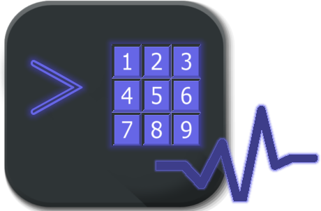

# PRIsh ❤

## Versão 1.1a

## O que é PRIsh?
Prish (Lê PRISHE) faz parte do **Projeto PRI**. É um utilitário em linha de comando criado em shell e visa ajudar as pessoas que estão passando por alguma necessidade fisica/mental e não consegue se comunicar com as pessoas.
Um exemplo é um pessoa que sofreu algum tipo de AVC, normalmente a pessoa apesar de ter uma confusão mental consegue fazer leituras simples, também em alguns casos **que é o caso que se baseamos este projeto** estas pessoas conseguem movimentar alguma parte do corpo, o dedo por exemplo.

Foi ai que surgiu a ideia deste software livre, um simples script em shell que tem frases pré-definidas e um menu que é personalizado com frases, basta apertar um número que a frase é dita.

## Coisas que você precisa saber
- 100% Software Livre. Não é utilizado nenhuma ferramenta ou utilitário no desenvolvimento do **PRIsh** que seja software fechado.
- Os áudios são pré-definidos e gravados já em formato **ogg**.
- O projeto está focado em ter um software que é executado 100% offline, por isso tudo que é online é descartado aqui. Levamos em consideração que pessoas que não tem **$** muitas vezes não tem internet.
- Por ser um utilitário criado em Shell Script e funciona via linha de comando, pode ser executado em qualquer computadores que tem um processamento mínimo.
- Todo programa é totalmente personalizável, permitindo o usuário final configurar a seu gosto.
- A documentação para o usuário final é muito importante e deve ser totalmente simples de se entender, o software **PRISh** e o **Projeto PRI** leva isso como uma bandeira única.

## A história de tudo isso
https://youtu.be/SLZFqMDMtJQ

## Dependências
- bash    >= 3.0
- pv      >= 1.6.6
- paplay  >= 9.0.0
- mutt    >= 1.10.1
- wget    >= 1.19.5

## Como instalar?

## Site do Projeto
https://projeto-pri.github.io/

## Como contribuir?
- Codando
- Criando uma documentação mais amigável e completa
- Com ideias
- Com Doações (Destinada para montar simples equipamentos e doar a hospitais ou pessoas que necessitam)
- Ajudando na divulgação, assim o projeto chega a quem precisa

## Changelog
https://github.com/projeto-pri/prish/blob/master/CHANGELOG.md

## Type Coding (Desenvolvedor LEIA)
https://github.com/projeto-pri/prish/blob/master/CONTRIBUTING.md
